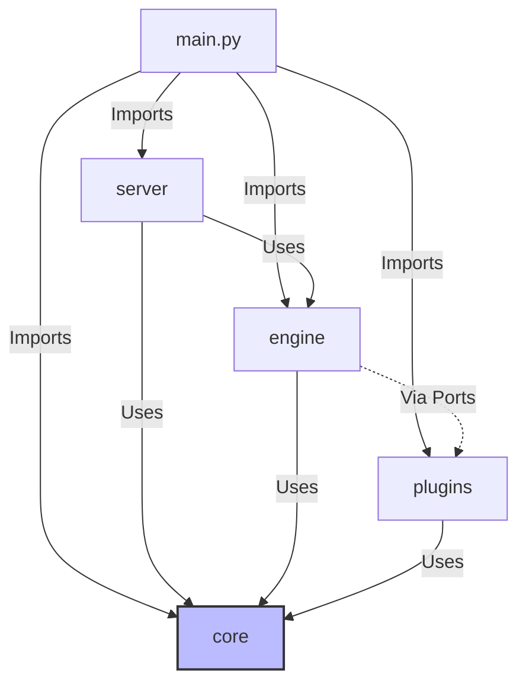
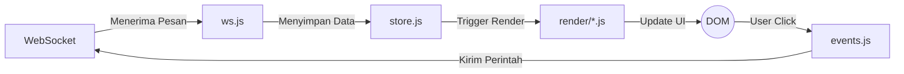

# Arsitektur bagas.fm

Dokumen ini menjelaskan arsitektur perangkat lunak dari `bagas.fm`. Proyek ini dibangun di atas prinsip **Clean Layered Architecture** pada sisi backend dan **Unidirectional Data Flow** (Aliran Data Searah) pada sisi frontend.

---

## 1. Arsitektur Backend (Clean Layered Architecture)

Backend `bagas.fm` ditulis menggunakan Python 3 dengan `aiohttp` dan `asyncio`. Arsitektur dibagi menjadi lapisan-lapisan (*layers*) yang terisolasi dengan ketat untuk memastikan tidak adanya ketergantungan melingkar (*circular dependency*) dan memudahkan *testing*.

### 1.1 Diagram Lapisan (Layers)

### 1.2 Aturan Ketergantungan (Dependency Rules)

1. **`core/`** (Shared Infrastructure): Lapisan terdalam. Berisi bus kejadian (`EventBus`), bus perintah (`CommandBus`), definisi antarmuka (ports), dan *state* aplikasi. **Tidak boleh** mengimpor dari lapisan manapun selain dirinya sendiri atau library standar Python.
2. **`engine/`** (Domain Logik & Playback): Lapisan bisnis utama yang mengatur pemutaran musik via MPV dan pengambilan data yt-dlp. **Hanya boleh** mengimpor `core/`. Komunikasi dengan lapisan eksternal (`plugins/`) dilakukan menggunakan konsep **Port dan Adapter** (didefinisikan di `core/ports.py`).
3. **`plugins/`** (Integrasi Eksternal): Layer khusus untuk layanan tambahan seperti SponsorBlock, sinkronisasi lirik, atau Termux Notifications. Boleh mengimpor `core/`.
4. **`server/`** (Web & API): Berfungsi sebagai jembatan HTTP dan WebSocket. Meneruskan instruksi *client* ke `engine` melalui `CommandBus` (komunikasi satu arah ke bawah) dan meneruskan respon *engine* (melalui `EventBus`) ke *client*.
5. **`main.py`** (Entrypoint): Berfungsi sebagai penyusun (wirer). Tugas utamanya adalah membaca konfigurasi, menginisialisasi setiap layer, menghubungkannya satu sama lain, dan menyalakan server. Tidak boleh ada logika bisnis.

### 1.3 Alur Kejadian (Command & Event Flow)

Aplikasi beroperasi berdasarkan dua alur utama:
- **Commands go DOWN**: `server` meneruskan perintah dari *client* (seperti `/play` atau `/pause`) ke `engine` menggunakan pola Command Router.
- **Events go UP**: `engine` menghasilkan *domain events* (seperti *TrackEnded* atau *ProgressUpdated*), mempublikasikannya ke `EventBus`, yang kemudian di-subscribe oleh `server` untuk di-broadcast kembali ke *client*.

---

## 2. Arsitektur Frontend (Vanilla JS)

Frontend menggunakan HTML, CSS (Vanilla), dan JS (Vanilla) yang dirancang untuk bekerja tanpa *framework* modern (seperti React/Vue), namun mengadopsi pola **Unidirectional Data Flow** ala Redux.

### 2.1 Aliran Data Searah (Unidirectional Data Flow)

### 2.2 Aturan Komponen

Untuk menjaga agar `app.js` tidak menjadi *God Object*, frontend dipecah menjadi modul-modul berikut:
1. **`store.js`**: **Satu-satunya tempat** yang menyimpan *state* global. Merupakan Single Source of Truth.
2. **`render/*.js`**: Modul yang **murni I/O**. Menerima *state* terbaru dari `store.js` dan merender struktur HTML ke DOM. Fungsi render tidak diperkenankan memasang `addEventListener` atau memanggil fungsi pengiriman pesan (`wsSend`).
3. **`events.js`**: **Satu-satunya tempat** yang menempelkan interaksi pengguna (melalui delegasi *event listener* utama).
4. **`ws.js`**: Menangani jembatan komunikasi jaringan (terima pesan server, modifikasi `store.js`, dan kirim pesan kembali).

---

## 3. Sistem Desain dan Token (CSS)

Antarmuka mengadopsi pola Design Tokens. File `css/tokens.css` berisi seluruh token (warna, ukuran, bayangan) di bawah `:root`. 
Semua berkas komponen (seperti `player.css`, `layout.css`, dsb.) **wajib** menggunakan referensi token (misal `var(--fm-bg-deep)`) dan dilarang mendefinisikan warna absolut (`#xxxxx`).
