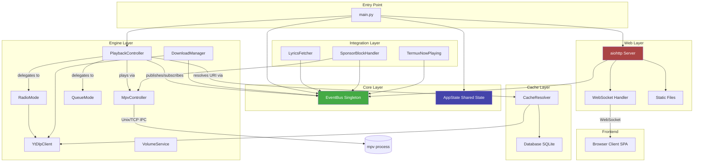
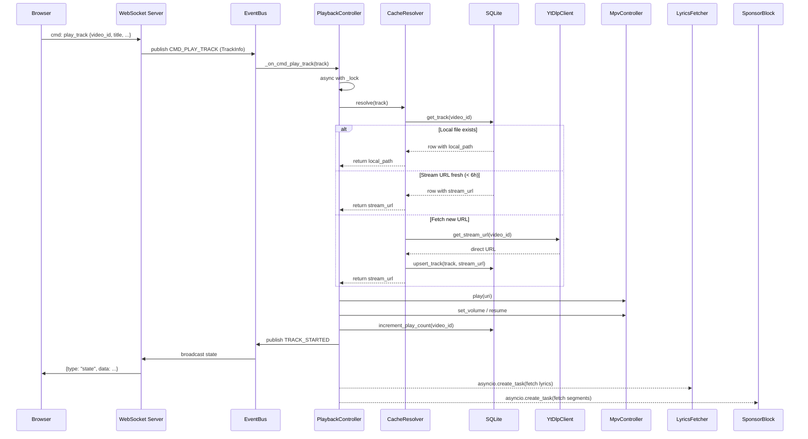
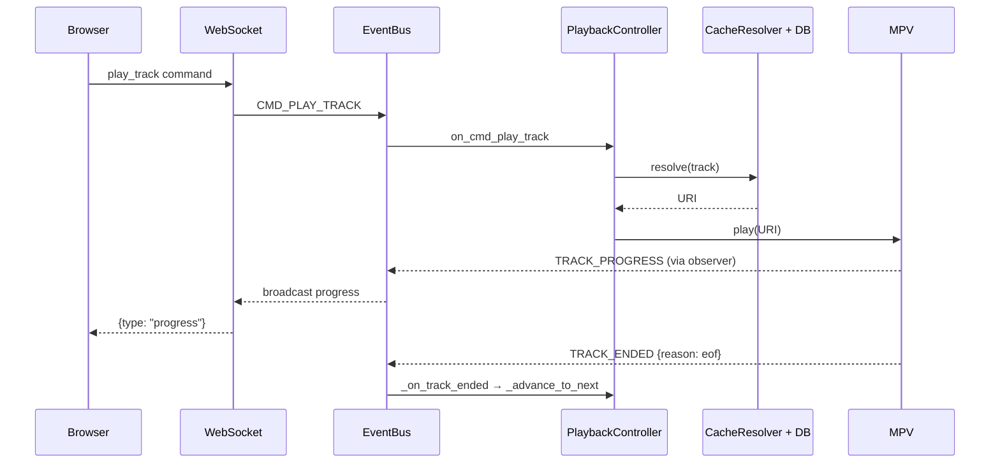

# HASIL AUDIT TEKNIS MENYELURUH — YTGUI / bagas.fm
> Auditor: Claude (Anthropic) — Technical Due Diligence Report
> Tanggal Audit: 22 Juni 2026
> Codebase: BAGAS.zip (114 files, ~518 KB, Python 3.13 + JS/CSS)

---

# EXECUTIVE SUMMARY

## Tujuan Aplikasi
YTGUI (alias **bagas.fm**) adalah platform pemutar musik YouTube berbasis Python yang dirancang untuk berjalan di Android melalui Termux. Aplikasi ini menyajikan dua antarmuka utama: Terminal UI (TUI) berbasis Textual, dan Web UI berbasis aiohttp/WebSocket yang dapat diakses browser jaringan lokal. Fitur inti meliputi pemutaran audio via MPV, pencarian YouTube (yt-dlp), Radio Mode dengan auto-queue, download MP3, sinkronisasi lirik real-time, SponsorBlock, notifikasi Android, dan sistem dua peran (Admin/Client).

## Tingkat Kematangan Produk
**Beta Akhir / Pre-Production.** Arsitektur sudah cukup matang dan terstruktur. Banyak fitur fungsional berjalan, namun terdapat sejumlah celah keamanan serius, absennya test coverage yang memadai, dan beberapa edge case belum tertangani.

## Kesiapan Produksi
**TIDAK SIAP PRODUKSI** — terutama karena:
1. Credential admin ter-hardcode di source code dan didokumentasikan publik di README.
2. Credential disimpan plaintext di `localStorage` browser.
3. Tidak ada HTTPS/WSS, rate limiting, atau proteksi DoS pada WebSocket.
4. Test coverage hampir nol (hanya 1 file test untuk EventBus).

## Kelebihan Utama
- Arsitektur event-driven yang bersih dan termodulasi dengan baik.
- EventBus singleton dengan weak-reference untuk mencegah memory leak.
- Radio Mode dengan rotasi artis anti-repetisi yang cerdas.
- Graceful shutdown dan cleanup resource yang diperhatikan.
- Cross-platform support (Termux/Android & Windows) dengan fallback yang benar.

## Risiko Terbesar
- **Credential bocor ke publik** (hardcoded + disimpan di localStorage).
- **Tidak ada proteksi DoS/flood** pada WebSocket dan endpoint streaming.
- **Single-user architecture** yang tidak didesain untuk deployment multi-user.

## Skor

| Dimensi | Skor | Catatan |
|---|---|---|
| **UX** | 6/10 | Alur baik, tapi onboarding minim, empty state kurang informatif |
| **UI** | 7/10 | Dark-theme konsisten, desain fungsional untuk mobile |
| **Backend** | 7/10 | Arsitektur event-driven solid, ada beberapa race condition |
| **Security** | 2/10 | Credential hardcoded & di localStorage — blocker produksi |
| **Scalability** | 3/10 | Single-threaded, single-user, tidak ada rate limiting |
| **Maintainability** | 7/10 | Struktur folder rapi, naming konsisten, tapi test minimal |
| **Overall** | 5/10 | Potensi besar, tapi belum siap rilis publik |

---

# 1. PROJECT UNDERSTANDING

## Fungsi Utama Aplikasi
YTGUI adalah "radio Termux pribadi" — sebuah server audio yang berjalan di HP Android (Termux), dapat dikontrol dari browser manapun di jaringan yang sama. Pengguna dapat mencari lagu YouTube, membuat antrean, mengaktifkan radio autoplay, mengunduh MP3, dan mendengarkan lirik sinkron — semuanya tanpa membuka YouTube di browser.

## Alur Pengguna
1. Jalankan `python main.py` di Termux → server aktif di port 8765.
2. Buka `http://<IP-HP>:8765` dari browser laptop/HP lain.
3. Pilih **Mode Client** (dengarkan saja) atau **Mode Admin** (kontrol penuh, perlu login).
4. Admin: cari lagu → play/enqueue → atur queue/radio/volume.
5. Client: dengarkan audio yang di-stream dari server secara real-time.

## Komponen Utama

| Modul | Path | Peran |
|---|---|---|
| `main.py` | root | Entry point, wiring semua komponen |
| `config.py` | root | Konfigurasi global (path, port, credential) |
| `core/event_bus.py` | core | Pub/sub bus singleton |
| `core/state.py` | core | AppState dataclass (shared mutable state) |
| `engine/mpv_controller.py` | engine | IPC ke mpv via Unix/TCP socket |
| `engine/playback_controller.py` | engine | Orkestrator playback, subscriber utama |
| `engine/radio_mode.py` | engine | Radio autoplay dengan rotasi artis |
| `engine/queue_mode.py` | engine | Queue FIFO playback |
| `engine/ytdlp_client.py` | engine | Wrapper yt-dlp async (thread executor) |
| `engine/download_manager.py` | engine | Download MP3 dengan progress hook |
| `engine/volume_service.py` | engine | Kontrol volume |
| `cache/db.py` | cache | aiosqlite persistent storage |
| `cache/resolver.py` | cache | URI resolver (lokal → cache → ytdlp) |
| `integrations/lyrics.py` | integrations | Fetch & parse lirik LRC dari lrclib.net |
| `integrations/sponsorblock.py` | integrations | Auto-skip sponsor via SponsorBlock API |
| `integrations/termux_notification.py` | integrations | Notifikasi Android via FIFO |
| `web/server.py` | web | aiohttp server + WebSocket bridge |
| `web/static/` | web/static | Frontend SPA (HTML/CSS/JS vanilla) |
| `tui/` | tui | Textual TUI (tidak diaudit mendalam — tidak dijalankan via main.py) |

## Dependency Penting

```
yt-dlp          # YouTube metadata & stream URL extraction
aiosqlite       # Async SQLite
aiohttp         # Async HTTP server + client
syncedlyrics    # Fallback lyrics provider (Musixmatch/NetEase)
mpv             # External process (audio engine)
ffmpeg          # External binary (untuk MP3 download)
```

## Gambaran Arsitektur



## Sequence Diagram: Alur Play Track



---

# 2. UX AUDIT

## H1: Visibility of System Status

### Temuan
- Status dot dan label teks (online/offline) tersedia di header. Status pemutaran (IDLE/LOADING/PLAYING/PAUSED/ERROR) diperbarui via WebSocket. Progress bar diperbarui ~3x/detik.
- Selama LOADING (resolving URL dari yt-dlp), tidak ada spinner khusus di Now Playing — hanya badge "LOADING" yang kecil.
- Saat MPV gagal spawn, pesan error dalam Bahasa Indonesia ditampilkan, namun tidak ada panduan tindakan yang jelas.

### Dampak
Medium

### Bukti Implementasi
`web/static/app.js:259` — `renderPlayBtn()` mengubah ikon tombol berdasarkan `store.status`, namun tidak ada animasi loading yang eksplisit di area Now Playing saat track sedang di-resolve.

### Rekomendasi
Tambahkan skeleton loader / spinner di area track info saat status `LOADING`. Tampilkan estimasi waktu tunggu saat yt-dlp sedang mengambil URL.

---

## H2: Match Between System and the Real World

### Temuan
- Terminologi sudah dalam Bahasa Indonesia yang natural ("Antrean", "Lirik", "Acak Ulang").
- Ikon emoji digunakan konsisten (📻 radio, 🔍 search, 📋 queue) — intuitif untuk pengguna mobile.
- Istilah "Mode Client" vs "Mode Admin" bisa membingungkan pengguna baru — tidak ada penjelasan singkat apa bedanya sebelum mereka memilih.

### Dampak
Low

### Rekomendasi
Perjelas deskripsi pada portal screen. Contoh: tambahkan keterangan "Dengarkan saja, tanpa kontrol" vs "Kontrol penuh pemutaran".

---

## H3: User Control and Freedom

### Temuan
- Tombol Stop menghapus seluruh queue — tidak ada konfirmasi. Ini adalah aksi destruktif.
- Tidak ada tombol "Undo" untuk penghapusan dari queue.
- Logout/ganti mode tersedia dengan jelas via tombol "🚪 Keluar".

### Dampak
Medium

### Bukti Implementasi
`web/server.py:_handle_ws_message` — action `stop` memanggil `_on_stop` yang melakukan `state.queue.clear()` dan `state.radio_queue.clear()` tanpa konfirmasi.

### Rekomendasi
Tambahkan dialog konfirmasi untuk aksi Stop (yang menghapus seluruh queue). Pertimbangkan fitur "undo hapus dari queue" dengan buffer sementara.

---

## H4: Consistency and Standards

### Temuan
- Shortcut keyboard di Web UI (`Space`, `N`, `B`) tidak konsisten dengan shortcut TUI (`P`, `N`, `B`, `S`). Misalnya: TUI menggunakan `[P]` untuk pause, Web UI menggunakan `Space`.
- Badge status (`💾`, `⏭️SB`, `⬇️`) tidak memiliki tooltip yang jelas tentang artinya bagi pengguna baru.

### Dampak
Medium

### Rekomendasi
Standardisasi shortcut antara TUI dan Web UI. Tambahkan tooltip pada badge status.

---

## H5: Error Prevention

### Temuan
- Volume bisa dinaikkan hingga 150% (melebihi 100%), yang bisa merusak audio. Tidak ada peringatan batas normal.
- Tidak ada validasi input pencarian minimum (bisa kirim string kosong meskipun ada guard `if query`).
- Download bisa dipicu berulang — sudah ada lock, namun pesan "sudah berjalan" tidak selalu tampil tepat waktu.

### Dampak
Medium

### Bukti Implementasi
`engine/volume_service.py:_on_volume_up` — `min(150, self.current_volume + 5)` — batas 150% tanpa peringatan UI.

### Rekomendasi
Tambahkan peringatan visual saat volume melebihi 100%. Tambahkan konfirmasi download jika file sudah ada secara lokal.

---

## H6: Recognition Rather Than Recall

### Temuan
- Shortcut keyboard tersedia di modal help (`?`), namun tidak ada petunjuk shortcut yang visible saat normal usage — pengguna harus ingat menekan `?` dulu.
- Mode saat ini (QUEUE/RADIO) ditampilkan sebagai badge kecil di player bar, mudah terlewat.

### Dampak
Low–Medium

### Rekomendasi
Tampilkan hint shortcut kecil di bawah player bar. Perbesar/perjelas indikator mode.

---

## H7: Flexibility and Efficiency

### Temuan
- Tidak ada fitur drag-and-drop untuk reorder queue.
- Tidak ada fitur "play next" (insert di depan queue), hanya "play now" dan "add to queue".
- Search langsung terhubung ke YouTube — tidak ada pencarian di library lokal/cache terlebih dahulu.

### Dampak
Medium

### Rekomendasi
Tambahkan opsi "Putar Selanjutnya" (queue insert at front). Pertimbangkan menampilkan lagu-lagu yang sudah di-cache dalam hasil pencarian.

---

## H8: Aesthetic and Minimalist Design

### Temuan
- Layout sudah minimalis dan fokus pada konten utama.
- Lagu saat ini di daftar queue memiliki tanda ▶ yang jelas.
- Lyrics panel di tab Queue sedikit tersembunyi — perlu scroll atau toggle eksplisit.

### Dampak
Low

### Rekomendasi
Pertimbangkan floating lyrics mini-display di player bar area.

---

## H9: Help Users Recognize, Diagnose, and Recover from Errors

### Temuan
- Error message ditampilkan via log toast yang muncul sebentar — bisa terlewat jika pengguna tidak memperhatikan.
- Saat MPV tidak ditemukan, pesan error di-set ke `state.error_msg` namun tampilan UI-nya tidak cukup prominent.
- Saat pencarian gagal/tidak ada hasil, pesan ditampilkan, namun tidak ada saran tindakan.

### Dampak
Medium

### Bukti Implementasi
`main.py:46-50` — `state.error_msg` diset saat MPV tidak tersedia, namun tidak ada dedicated error screen.

### Rekomendasi
Buat dedicated error state screen saat MPV tidak tersedia. Buat log toast error lebih persistent (tidak hilang otomatis untuk pesan kritis).

---

## H10: Help and Documentation

### Temuan
- README dan MANUAL_BOOK.md tersedia dan cukup lengkap.
- Help modal di Web UI sudah mencantumkan shortcut keyboard.
- Tidak ada onboarding flow untuk pengguna pertama kali (langsung portal login tanpa tutorial singkat).
- README secara eksplisit menyebutkan username dan password admin — ini **security issue, bukan UX feature**.

### Dampak
Medium (UX) / Critical (Security)

### Rekomendasi
Hapus credential dari README. Tambahkan onboarding tooltip singkat saat pertama kali buka aplikasi.

---

## Friction Points & Issues Ringkasan UX

| Issue | Severity |
|---|---|
| Tidak ada loading indicator saat resolve URL | Medium |
| Stop action destruktif tanpa konfirmasi | Medium |
| Credential di README (UX trust issue) | Critical |
| Shortcut inkonsisten TUI vs Web UI | Medium |
| Volume bisa 150% tanpa warning | Low |
| Tidak ada undo hapus queue | Low |
| Onboarding nol | Medium |

**Skor UX: 6/10**

---

# 3. UI AUDIT

## Visual Hierarchy
Dark theme dengan palette biru-gelap (`#1a1a2e`, `#16213e`, `#0f3460`) memberikan kontras yang baik. Player bar selalu visible di bottom — hierarki yang tepat untuk audio player. Namun area "Now Playing" di tab home terlalu minimalis — hanya teks judul dan artis tanpa thumbnail.

## Konsistensi Desain
Konsisten menggunakan emoji sebagai ikonografi. Warna status yang konsisten (`var(--status-ok)` hijau untuk aktif, merah untuk error). Namun: progress bar di player bar menggunakan div custom, sementara di area lyrics tidak ada progress indikator — inkonsistensi minor.

## Typography
Menggunakan system font stack. Ukuran font hierarkis jelas (title > artist > metadata). Lirik menggunakan monospace-style untuk keterbacaan — tepat.

## Layout & Responsiveness
- Meta viewport `maximum-scale=1.0, user-scalable=no` — baik untuk native app feel di mobile, namun buruk untuk aksesibilitas (mencegah zoom).
- Bottom navigation + top header mengikuti pola mobile-first yang tepat.
- Belum diuji di tablet landscape — kemungkinan layout terlalu sempit.

## Mobile Usability
Touch targets (tombol nav, play controls) cukup besar. Swipe gesture tidak tersedia — navigasi hanya via tombol. Progress bar bisa di-tap untuk seek — fungsional.

## Desktop Usability
Shortcut keyboard tersedia via help modal. Layout di desktop terlihat narrow (desain mobile-first). Tidak ada adaptasi layout untuk layar lebar.

## Accessibility
Lihat Section 4 untuk WCAG audit lengkap.

## Feedback/Loading State
- Spinner (`<span class="spinner">`) digunakan saat pencarian — baik.
- Saat LOADING track, tidak ada feedback visual yang jelas di area Now Playing.
- Download progress ditampilkan via badge — cukup, tapi tidak ada progress bar visual.

## Color Usage
Dark theme dengan aksen biru (`#e94560` merah untuk error/stop, biru untuk aksi positif). Kontras teks utama terhadap background cukup, namun teks `var(--text-dim)` perlu dicek rasio kontras.

## Iconography
Emoji-based iconography — cross-platform tanpa custom font. Risiko: rendering tidak konsisten antar OS/browser (terutama emoji versi lama Android).

## CSS Architecture
`style.css` (1496 baris) monolithic — semua gaya dalam satu file. CSS Variables digunakan secara konsisten untuk color tokens (`--bg-deep`, `--accent`, `--text-dim`, dll.) — ini praktik yang baik. Namun tidak ada CSS modularization atau component architecture yang formal.

**Skor UI: 7/10**

---

# 4. ACCESSIBILITY AUDIT (WCAG 2.2)

## Perceivable

| Temuan | Severity | File |
|---|---|---|
| `<meta name="viewport" ... user-scalable=no>` mencegah zoom — pelanggaran 1.4.4 (Resize Text) | **Major** | `index.html:5` |
| Tidak ada `alt` attribute pada elemen gambar/thumbnail jika ditampilkan | Major | `web/static/app.js` |
| Rasio kontras `--text-dim` (#888) terhadap background (#1a1a2e) ≈ 2.8:1 — di bawah minimum WCAG 4.5:1 | **Critical** | `style.css` |
| Equalizer canvas tidak memiliki text alternative (dekoratif, bisa `aria-hidden="true"`) | Minor | `index.html:62` |

## Operable

| Temuan | Severity | File |
|---|---|---|
| Progress bar custom (`div.pb-progress-track`) tidak bisa dikontrol keyboard — hanya touch/click | Major | `index.html:98-103` |
| Modal overlay tidak trapping focus — tab key bisa keluar modal | Major | `web/static/app.js` |
| Tidak ada `role="dialog"` / `aria-modal="true"` pada modal overlay | Major | `index.html` |
| Shortcut keyboard (`Space`, `N`, `B`, dll.) bisa konflik dengan screen reader shortcuts | Medium | `app.js` |

## Understandable

| Temuan | Severity | File |
|---|---|---|
| Input pencarian tidak memiliki `<label>` — hanya `placeholder` | Major | `index.html:70` |
| Input username/password admin tidak memiliki `<label>` eksplisit | Major | `index.html:38-41` |
| Error message untuk login gagal tidak di-associate dengan input via `aria-describedby` | Minor | `index.html:42` |
| `lang="id"` sudah benar di `<html>` — ✓ | Pass | `index.html:2` |

## Robust

| Temuan | Severity | File |
|---|---|---|
| Tidak ada `role` eksplisit pada navigasi bottom bar — tidak jelas sebagai `nav` dengan `aria-label` | Minor | `index.html` |
| Tab panel tidak menggunakan `role="tabpanel"` dan `aria-labelledby` | Major | `index.html` |
| Tidak ada `aria-live` region untuk log toast — screen reader tidak membaca notifikasi | Major | `index.html` |

## Rekomendasi Aksesibilitas
1. Hapus `user-scalable=no` dari viewport meta.
2. Tambahkan `<label>` untuk semua input.
3. Implementasikan focus trap pada modal.
4. Tambahkan `aria-live="polite"` pada toast notification.
5. Perbaiki rasio kontras `--text-dim` minimal ke 4.5:1.
6. Tambahkan `role="tab"` / `role="tabpanel"` pada sistem navigasi.

---

# 5. BACKEND AUDIT

## Arsitektur

### Layering
Aplikasi menggunakan 5 layer yang jelas:
- **Core**: EventBus + AppState (tidak berubah oleh siapapun kecuali melalui event)
- **Engine**: Logic bisnis (Playback, Radio, Queue, Volume, Download)
- **Cache**: Persistence (SQLite + CacheResolver)
- **Integration**: Third-party (MPV IPC, lrclib, SponsorBlock, Termux)
- **Web**: Server + WebSocket bridge

### Separation of Concerns
Baik. Modul-modul tidak saling import langsung — semua komunikasi melalui EventBus. Satu pengecualian: `PlaybackController` menerima dependensi langsung (MPV, Resolver, dll.) melalui constructor — ini acceptable sebagai service orchestrator.

### Modularitas
Tinggi. Setiap modul memiliki komentar "Subscribes to" dan "Publishes" yang mendokumentasikan kontrak event-nya. Ini adalah praktik arsitektur yang sangat baik.

### Dependency Coupling
Rendah antar modul engine. Coupling tinggi hanya pada `AppState` yang di-share sebagai mutable state. Tidak ada circular import.

### Cohesion
Tinggi. Setiap class memiliki satu tanggung jawab yang jelas.

---

## Data Flow



---

## Event System

### Kekuatan
- Handler exception tidak menghentikan handler lain — error isolation terjamin (`event_bus.py:59-67`).
- WeakMethod reference untuk bound methods mencegah memory leak pada subscriber yang hidup lebih pendek dari bus.
- Event name constants terdefinisi — tidak ada magic string tersebar.

### Race Condition Risk
**Ditemukan:** `PlaybackController._on_next` dan `_on_cmd_play_track` keduanya menggunakan `async with self._lock`, namun `_on_track_ended` memanggil `_on_next` tanpa lock:

```python
# engine/playback_controller.py:103-107
async def _on_track_ended(self, data: dict):
    reason = data.get("reason")
    if reason == "eof":
        await self._on_next()  # _on_next memiliki lock
```

`_on_next` sudah memiliki lock internalnya sendiri, namun jika `CMD_NEXT` dan `TRACK_ENDED` tiba secara hampir bersamaan (misalnya pengguna menekan Next saat track hampir selesai), keduanya bisa antri di lock yang sama dan memanggil `_advance_to_next` dua kali. Ini mengakibatkan dua track di-skip.

### Event Explosion Risk
Rendah. Tidak ada event yang men-trigger event lain dalam loop yang tidak terbatas.

### Memory Leak Risk
Rendah dengan catatan: Lambda/fungsi biasa (non-method) disimpan sebagai strong reference (`core/event_bus.py:20`). Jika fungsi lokal di `web/server.py` (seperti `_on_track_started`) di-subscribe namun `app` di-garbage collect, referensi tetap hidup. Namun dalam skenario ini `app` memiliki lifetime sama dengan server — aman.

---

## API (WebSocket)

### Desain
WebSocket single endpoint (`/ws`) dengan message format `{type, action, data}` — konsisten dan sederhana. Tidak ada versioning API.

### Payload Consistency
Baik. Semua broadcast menggunakan format `{type: string, data: any}` yang konsisten.

### Error Contract
Kurang: error dikembalikan sebagai `{type: "error", data: string}` — tidak ada error code, tidak ada stack trace terstruktur untuk debugging klien.

### Authentication
Autentikasi per-WebSocket connection menggunakan set `authenticated_connections`. Ini benar secara konsep, namun:
1. Tidak ada session timeout.
2. Jika koneksi terputus lalu reconnect, client harus re-authenticate — ini sudah ditangani di `app.js:wsConnect`.
3. Tidak ada rate limiting untuk percobaan login.

### REST Endpoints
Hanya 3 endpoint HTTP:
- `GET /` → serve `index.html`
- `GET /ws` → WebSocket upgrade
- `GET /api/stream/{video_id}` → stream atau redirect ke YouTube URL

Endpoint `/api/stream/{video_id}` **tidak memerlukan autentikasi** — siapa pun di jaringan dapat mengakses stream URL lagu yang sedang diputar.

---

## Cache

### Invalidasi
Stream URL cache di-expire setelah 6 jam (21600 detik) — tepat karena YouTube signed URL memiliki masa berlaku.

### Konsistensi
Baik. `upsert_track` menggunakan `ON CONFLICT ... DO UPDATE SET ... COALESCE(excluded.stream_url, tracks.stream_url)` — tidak menimpa nilai existing dengan NULL.

### Potensi Stale Data
- Jika `local_path` ada di DB tapi file dihapus manual, `CacheResolver` sudah mengecek `os.path.isfile(path)` sebelum return — ✓
- WAL mode diaktifkan untuk performa concurrent read — ✓

### Eviction Policy
`Database.init()` menghapus track yang tidak diputar >30 hari dan belum di-download. Logika ini berjalan setiap startup — kurang efisien untuk database besar, lebih baik dijadikan scheduled task.

---

## MPV Integration

### Fault Tolerance
- `connect()` melakukan retry hingga 10 kali setiap 0.5 detik sebelum menyerah.
- `is_connected` flag mencegah command dikirim ke socket yang sudah mati.
- Semua `_command()` yang gagal (`OSError`) menset `is_connected = False`.

### Recovery
**Tidak ada auto-reconnect.** Jika MPV mati setelah startup, `is_connected` menjadi False dan semua command diabaikan, namun tidak ada mekanisme untuk restart MPV dan reconnect. Ini adalah gap yang cukup serius untuk aplikasi yang berjalan lama.

### Timeout
`_get_property` menggunakan `asyncio.wait_for(fut, timeout=2.0)` — baik. Namun `_command` (fire-and-forget) tidak memiliki timeout — potensi pending forever jika socket buffer penuh.

### State Synchronization
MPV property observer aktif untuk `time-pos` dan `pause` — state UI selalu sinkron dengan kondisi aktual MPV.

---

## Queue/Playlist

### Konsistensi State
`state.queue` (deque) dan `state.radio_queue` (deque) benar-benar terpisah — tidak ada campur tangan antar mode, sesuai "constitution" yang didokumentasikan di komentar.

### Edge Case
- `_on_queue_select` melakukan `popleft` sebanyak `index + 1` untuk mencapai track yang dipilih — semua track sebelumnya dibuang. Ini behavior yang mungkin tidak intuitif (lagu yang di-skip tidak masuk history).
- `_on_queue_remove` menggunakan `del self.state.queue[index]` — operasi O(n) pada deque, kurang efisien untuk queue besar tapi acceptable untuk use case ini.

### Concurrent Access
Lock di `PlaybackController._lock` melindungi operasi play dan next. Namun `_on_queue_remove` dan `_on_queue_add` tidak menggunakan lock — jika terjadi concurrent remove dan play (edge case di multi-client), bisa ada index out-of-range.

**Skor Backend: 7/10**

---

# 6. SECURITY AUDIT

| Temuan | Severity | Lokasi | Risiko | Solusi |
|---|---|---|---|---|
| **Credential hardcoded di config.py** (`bagasfm`/`bagasradio2626@`) | **Critical** | `config.py:33-34` | Siapa pun yang dapat akses kode mendapat kredensial produksi | Hanya load dari environment variable, tidak ada fallback default hardcoded |
| **Credential didokumentasikan di README.md** | **Critical** | `README.md:L97-98` | Siapa pun yang membaca README memiliki akses admin | Hapus dari README, gunakan env var, generate password random saat pertama setup |
| **Password disimpan plaintext di localStorage** | **Critical** | `app.js:173-174` | XSS bisa mencuri password; siapa pun yang punya akses ke browser mendapat password | Gunakan session token (server-issued) bukan simpan password |
| **Tidak ada HTTPS / WSS** | **High** | Arsitektur | Credential dan session dikirim plaintext di jaringan WiFi | Implementasikan self-signed cert atau tunnel via ngrok/tailscale untuk akses remote |
| **Endpoint `/api/stream/{video_id}` tanpa autentikasi** | **High** | `web/server.py:218-240` | Siapa pun di jaringan dapat mengambil stream URL lagu | Require authentication token di header atau query param |
| **Tidak ada rate limiting pada WebSocket commands** | **High** | `web/server.py:255-370` | Client bisa flood server dengan ribuan `search` command, men-trigger banyak yt-dlp processes | Implementasikan per-connection rate limiter |
| **Tidak ada rate limiting pada percobaan login** | **High** | `web/server.py:263-274` | Brute force password admin via WebSocket | Tambahkan lockout setelah N percobaan gagal |
| **`video_id` di endpoint stream tidak divalidasi dengan ketat** | **Medium** | `web/server.py:218` | Karakter `alphanumeric + dash + underscore` di-sanitize, namun bisa digunakan untuk traverse cache directory | Gunakan regex strict `^[a-zA-Z0-9_-]{11}$` (YouTube ID standard) |
| **MPV di-spawn dengan `yt-dlp` path yang ditemukan dari `PATH`** | **Medium** | `engine/mpv_controller.py:33-35` | Jika `PATH` dimanipulasi (lingkungan tidak trusted), binary berbahaya bisa dipanggil | Validasi absolute path yt-dlp, atau hardcode lokasi yang diketahui |
| **WebSocket broadcast ke ALL clients (termasuk yang unauthenticated)** | **Medium** | `web/server.py:98` | Client mode bisa menerima informasi queue, lirik, bahkan `local_path` file di server | Filter data yang dikirim ke unauthenticated clients |
| **`local_path` di `_state_to_dict` dikirim ke browser** | **Medium** | `web/server.py:47-58` | Client browser mendapat path file server (misal `/data/data/com.termux/files/home/cache/mp3/xxxx.mp3`) — information disclosure | Hapus `local_path` dari respons WebSocket |
| **Tidak ada CSRF protection pada WebSocket** | **Low** | `web/server.py:205` | WebSocket dari domain lain bisa terhubung (tapi perlu tahu IP:port server) | Validasi `Origin` header pada WebSocket handshake |
| **Log error bisa mengekspos path internal** | **Low** | `web/server.py:390` | `str(e)` dikirim ke browser saat error handler — bisa mengekspos internal info | Sanitasi error message yang dikirim ke client |
| **Termux notification FIFO scripts bisa ditulis oleh user lain** | **Low** | `integrations/termux_notification.py:78` | Script di `_SOCK_DIR` dengan permission 755 — dalam Termux single-user, aman, tapi path traversal via symlink | Pastikan `_SOCK_DIR` berada di direktori yang tidak dapat ditulis oleh proses lain |

**Skor Security: 2/10** — Terdapat 3 temuan Critical yang merupakan blocker absolut untuk deployment publik.

---

# 7. PERFORMANCE AUDIT

## Startup Performance
Startup melibatkan: init DB, spawn MPV process, poll socket (max 5 detik), start connectivity checker, start web server. Total startup ≈ 2-6 detik — acceptable untuk Termux.

## Runtime Performance

### Event Loop
Semua komponen async. Satu-satunya blocking call adalah `yt_dlp` yang sudah benar di-offload ke `loop.run_in_executor(None, ...)` (thread pool). Ini mencegah event loop blocking.

### WebSocket Progress Broadcast
Throttle 3x/detik sudah diterapkan via `time.monotonic()` guard. Baik.

### Radio Mode Network Calls
Saat fetch batch, `asyncio.gather(*[search_artist(a) for a in artists])` menjalankan 4 search parallel — efisien, namun berpotensi membebani yt-dlp jika ARTISTS_PER_BATCH ditingkatkan.

```python
# engine/radio_mode.py:199-205
results_per_artist = await asyncio.gather(
    *[self._search_artist(artist) for artist in chosen],
    return_exceptions=True,
)
```

Namun `_search_lock = asyncio.Semaphore(1)` di dalam `_search_artist` **membatalkan efek paralel** — semua search akan antri satu per satu. Ini inkonsistensi: gather digunakan untuk paralel, tapi semaphore membuatnya serial.

## Memory Usage
- `state.history` dibatas `maxlen=50` — baik.
- `state.radio_queue` tidak dibatasi ukurannya — berpotensi tumbuh tak terbatas jika `prefetch_next` terus dipanggil.
- `_pending` dict di `MpvController` bisa leak jika banyak `_get_property` call yang timeout tidak di-cleanup (sudah ada `pop` di timeout handler — aman).

## MPV Interaction Efficiency
`_observe_events` sudah subscribe `time-pos` dan `pause` — push-based, tidak polling. Efisien.

## Cache Efficiency
6-jam TTL untuk stream URL adalah tradeoff yang baik. Local MP3 cache tidak di-evict kecuali dihapus manual.

## Quick Wins

1. **Fix Semaphore di Radio batch search** — hapus `_search_lock` atau pindah ke level yang lebih tinggi, biarkan 4 search parallel berjalan. Estimasi speedup: 3-4x pada radio initial load.
2. **Batasi ukuran `radio_queue`** — maksimalkan di 20-30 track untuk batas memori.
3. **Cache DB eviction** — jalankan via `asyncio.create_task` bukan inline di `init()`.

## Long-Term Improvements

1. **Connection pooling untuk HTTP** — aiohttp `ClientSession` sudah di-share, tapi bisa lebih optimal dengan `TCPConnector` explicit.
2. **Preload thumbnail** — fetch thumbnail saat search, simpan URL di cache, hindari re-fetch.
3. **Metrics tracking** — catat waktu resolve, waktu yt-dlp search, untuk profiling jangka panjang.

---

# 8. MAINTAINABILITY AUDIT

## Struktur Folder
Excellent. Pemisahan layer sangat jelas:
```
/core       → infra (bus, state)
/engine     → business logic
/cache      → persistence
/integrations → third-party
/web        → server + static
/tui        → terminal UI
/tests      → unit tests
/widgets    → Termux shortcuts
```

## Naming Convention
Konsisten. Python: snake_case untuk fungsi/variabel, PascalCase untuk class. Event names: string constant di `event_bus.py` (tidak ada magic string tersebar). JS: camelCase konsisten.

## Code Duplication
- `DiscoverService` terlihat tidak digunakan — instantiasi tidak ada di `main.py`. Dead code.
- TUI (`tui/`) tampaknya sudah tidak diintegrasikan ke `main.py` (hanya web server yang dijalankan) — potensi dead code yang signifikan.

### Bukti:
```python
# main.py — tidak ada import dari tui/ atau services/discover_service.py
```

## Technical Debt
- Komentar "CRITICAL-01 fix", "CRITICAL-03 fix", "HIGH-02 fix" tersebar di kode — menandakan perbaikan ad-hoc dari iterasi sebelumnya. Ini baik untuk traceability tapi menandakan debt belum direfactor ke desain yang clean.
- `AppState` adalah mutable shared state tanpa locking — berjalan aman hanya karena asyncio single-threaded, tapi rapuh jika ada threading di masa depan.

## Testability
Rendah. Hampir semua class menggunakan dependensi konkret (bukan interface/protocol). Tidak ada dependency injection formal. Sulit untuk unit test tanpa menjalankan MPV asli.

## Documentation Quality
Baik. Setiap modul memiliki docstring "Purpose / Subscribes to / Publishes". README dan MANUAL_BOOK tersedia.

## Readability
Tinggi. Kode bersih dan readable. Inline comment menjelaskan keputusan non-obvious (misalnya WHY menggunakan WeakMethod, WHY 6-jam TTL).

**Skor Maintainability: 7/10**

---

# 9. TESTING AUDIT

## Coverage Saat Ini
Hanya `tests/test_event_bus.py` — 4 test cases untuk EventBus:
- Strong reference handler
- Weak reference handler (GC-safe)
- Unsubscribe
- Error isolation

Tidak ada test untuk: PlaybackController, MpvController, RadioMode, CacheResolver, Database, WebSocket handler, YtDlpClient, LyricsFetcher, SponsorBlockHandler.

**Estimasi coverage: < 5%**

## Missing Test Scenarios Prioritas Tinggi

| No | Test Scenario | Modul | Prioritas |
|---|---|---|---|
| 1 | CacheResolver: local file exists → return path | `cache/resolver.py` | Critical |
| 2 | CacheResolver: stream URL fresh (<6h) → return cached | `cache/resolver.py` | Critical |
| 3 | CacheResolver: URL stale → fetch new from yt-dlp | `cache/resolver.py` | Critical |
| 4 | PlaybackController: play_track success flow | `engine/playback_controller.py` | Critical |
| 5 | PlaybackController: play_track error → retry → skip | `engine/playback_controller.py` | High |
| 6 | PlaybackController: track_ended eof → advance_to_next | `engine/playback_controller.py` | High |
| 7 | RadioMode: batch dedup judul yang sama | `engine/radio_mode.py` | High |
| 8 | RadioMode: rotasi artis tidak repeat sebelum full cycle | `engine/radio_mode.py` | Medium |
| 9 | Database: upsert_track COALESCE tidak timpa local_path | `cache/db.py` | High |
| 10 | WebSocket auth: reject non-authenticated command | `web/server.py` | Critical |
| 11 | WebSocket auth: brute force lockout (setelah diimplementasi) | `web/server.py` | High |
| 12 | QueueMode: queue empty → status IDLE | `engine/queue_mode.py` | Medium |
| 13 | VolumeService: volume capped at 150 | `engine/volume_service.py` | Low |
| 14 | LyricsFetcher: parse LRC format | `integrations/lyrics.py` | Medium |
| 15 | SponsorBlock: seek saat dalam segment | `integrations/sponsorblock.py` | Medium |

---

# 10. DEVOPS & OBSERVABILITY AUDIT

## Logging
- `RotatingFileHandler` digunakan dengan `maxBytes=1MB, backupCount=2` — baik untuk storage terbatas di Termux.
- Global log level: `WARNING` — hanya warning dan error yang tercatat. Debug/info calls ada namun tidak akan muncul di production log.
- Log format: `timestamp [name] level: message` — cukup, tapi tidak ada request ID atau correlation ID untuk tracing multi-komponen.
- **Gap**: Tidak ada logging untuk autentikasi events (login success/fail) — penting untuk security audit trail.

## Monitoring
Tidak ada. Tidak ada health check endpoint, tidak ada metrics (Prometheus, dsb.), tidak ada alerting.

## Health Checks
**Tidak ada** `GET /health` atau `GET /status` endpoint. Sulit untuk load balancer atau monitoring tools.

## Graceful Shutdown
Ada di `main.py:finally` block:
```python
lyrics_fetcher.cleanup()
sponsorblock.cleanup()
await nowplaying.cleanup()
ytdlp.cancel_download()
await http_session.close()
await mpv.close()
await db.close()
```
Cukup baik. Namun `connectivity_task` di-cancel tapi tidak di-await sepenuhnya — bisa ada asyncio warning `Task was destroyed but it is pending`.

## Recovery Strategy
Tidak ada. Jika `main.py` crash, aplikasi mati. Tidak ada supervisor process (systemd, supervisord, pm2) yang otomatis restart.

## Deployment Readiness

| Aspek | Status |
|---|---|
| Environment variables untuk config | Sebagian (port/host pakai env var, tapi credential punya hardcoded fallback) |
| Startup script / service file | Tidak ada |
| Dependency pinning | Tidak ada (requirements.txt tanpa versi pinned) |
| Docker/container | Tidak ada |
| Deployment documentation | Terbatas (hanya manual install di README) |

## Environment Management
`requirements.txt` tanpa version pinning:
```
yt-dlp
aiosqlite
aiohttp
syncedlyrics
```
Ini berisiko: `yt-dlp` merilis update yang bisa breaking change kapan saja. Untuk production, semua dependency harus di-pin (`yt-dlp==2025.x.x`).

## Rekomendasi DevOps

1. Tambahkan `GET /health` endpoint yang mengecek: DB connection, MPV connection, last successful play.
2. Buat `requirements-prod.txt` dengan version pinning.
3. Buat startup script Termux: `start.sh` dengan export env vars + restart loop.
4. Implementasikan structured logging (JSON) untuk kemudahan parsing.
5. Tambahkan log untuk semua authentication events.

---

# 11. TECHNICAL DEBT

| Item | Dampak | Prioritas | Estimasi Effort |
|---|---|---|---|
| Credential hardcoded di `config.py` | BLOCKER untuk produksi | Critical | 2 jam |
| Password disimpan di localStorage | BLOCKER keamanan | Critical | 4 jam |
| Tidak ada HTTPS | BLOCKER untuk remote access | Critical | 1 hari |
| Tidak ada rate limiting WebSocket | Rentan DoS | High | 4 jam |
| TUI (`tui/`) kemungkinan dead code | Confusing untuk kontributor baru | Medium | 1 hari (verify + hapus) |
| `DiscoverService` tidak digunakan | Dead code | Low | 30 menit |
| Semaphore di radio mode membatalkan paralel | Performa radio lambat | Medium | 1 jam |
| Tidak ada MPV auto-reconnect | App bisa freeze jika MPV crash | High | 1 hari |
| `deque` `radio_queue` tidak dibatasi | Memory leak potensial | Medium | 30 menit |
| Tidak ada version pinning di requirements | Dependency roulette | High | 1 jam |
| Test coverage < 5% | Regresi tidak terdeteksi | High | 1-2 minggu |
| `local_path` bocor ke browser | Information disclosure | Medium | 1 jam |
| Tidak ada health check endpoint | Tidak bisa dimonitor | Medium | 2 jam |
| Eviction DB saat startup (bukan scheduled) | Startup lambat jika DB besar | Low | 2 jam |
| Tidak ada error code terstruktur di WebSocket | Debug client sulit | Low | 3 jam |

---

# 12. ROADMAP

## 30 Hari — Perbaikan Kritis

### Security
- [ ] Hapus credential default dari `config.py` — wajib set via env var atau first-run wizard
- [ ] Hapus credential dari `README.md`
- [ ] Ganti simpan password di localStorage dengan server-issued session token
- [ ] Tambahkan rate limiting login (max 5 percobaan per 5 menit)
- [ ] Filter `local_path` dari broadcast WebSocket

### Backend
- [ ] Implementasikan MPV auto-reconnect jika koneksi hilang
- [ ] Fix race condition double-advance (lock di `_on_track_ended`)
- [ ] Pin dependency di `requirements.txt`
- [ ] Batasi ukuran `radio_queue` (max 30 track)

### DevOps
- [ ] Tambahkan `GET /health` endpoint
- [ ] Buat `start.sh` wrapper dengan env var documentation
- [ ] Tambahkan log untuk authentication events

## 60 Hari — Perbaikan Menengah

### UX
- [ ] Loading skeleton di Now Playing saat track sedang di-resolve
- [ ] Konfirmasi dialog untuk aksi Stop
- [ ] Opsi "Putar Selanjutnya" (insert at front of queue)

### Backend
- [ ] Fix semaphore radio mode (biarkan parallel, atau naikan limit)
- [ ] Validasi `Origin` header pada WebSocket handshake (CSRF mitigation)
- [ ] Rate limiting untuk semua WebSocket commands (bukan hanya auth)

### Testing
- [ ] Unit test untuk `CacheResolver` (semua 3 path)
- [ ] Unit test untuk `PlaybackController` (success + error path)
- [ ] Unit test untuk `WebSocket auth` handler

### DevOps
- [ ] Implement structured logging (JSON format)
- [ ] Environment management documentation

## 90 Hari — Peningkatan Lanjutan

### UX/UI
- [ ] Drag-and-drop queue reorder
- [ ] Desktop-optimized layout (responsive breakpoints)
- [ ] Onboarding tooltip untuk pengguna baru
- [ ] Fix aksesibilitas WCAG (label, focus trap, aria-live)

### Backend
- [ ] Scheduled DB eviction (bukan saat startup)
- [ ] Perbaiki `DiscoverService` integration ke Web UI (recent/favorites tab)
- [ ] Pertimbangkan multi-user support (per-user session state)

### Security
- [ ] HTTPS support via self-signed cert atau reverse proxy documentation
- [ ] WebSocket origin validation

### DevOps
- [ ] Docker/container support untuk deployment non-Termux
- [ ] Integration test suite

---

# 13. TOP 10 PRIORITAS

1. **Hapus credential hardcoded dari config.py dan README.md**
   - Dampak: Eliminasi risiko credential leak yang paling dasar
   - Estimasi usaha: 2–4 jam
   - Prioritas: **P0 / Blocker**

2. **Ganti password storage di localStorage dengan session token**
   - Dampak: Mencegah credential theft via XSS atau akses fisik browser
   - Estimasi usaha: 1 hari (server-side token generation + JS update)
   - Prioritas: **P0 / Blocker**

3. **Tambahkan rate limiting untuk percobaan login**
   - Dampak: Mencegah brute force credential admin
   - Estimasi usaha: 4 jam
   - Prioritas: **P1 / Critical**

4. **Implementasikan MPV auto-reconnect**
   - Dampak: Stabilitas jangka panjang — tanpa ini, app bisa diam total jika MPV crash
   - Estimasi usaha: 1 hari
   - Prioritas: **P1 / Critical**

5. **Pin semua dependency di requirements.txt**
   - Dampak: Menghindari breaking update dari yt-dlp atau aiohttp
   - Estimasi usaha: 1 jam
   - Prioritas: **P1 / High**

6. **Tambahkan test coverage untuk CacheResolver dan PlaybackController**
   - Dampak: Mencegah regresi pada logika inti pemutaran dan caching
   - Estimasi usaha: 3 hari
   - Prioritas: **P1 / High**

7. **Fix radio mode Semaphore yang membatalkan parallel search**
   - Dampak: Radio initial load bisa 3–4x lebih cepat
   - Estimasi usaha: 1 jam
   - Prioritas: **P2 / Medium**

8. **Filter `local_path` dari WebSocket broadcast**
   - Dampak: Eliminasi information disclosure ke browser
   - Estimasi usaha: 30 menit
   - Prioritas: **P2 / Medium**

9. **Tambahkan health check endpoint `/health`**
   - Dampak: Memungkinkan monitoring dan restart otomatis via supervisor
   - Estimasi usaha: 2 jam
   - Prioritas: **P2 / Medium**

10. **Tambahkan loading indicator di Now Playing saat status LOADING**
    - Dampak: UX improvement signifikan — pengguna tahu sistem sedang bekerja
    - Estimasi usaha: 2 jam (frontend only)
    - Prioritas: **P2 / Medium**

---

# 14. KESIMPULAN

## Apakah Aplikasi Siap Production?

**Tidak.** Terdapat tiga blocker keamanan level Critical yang harus diselesaikan terlebih dahulu:

1. Credential admin ter-hardcode dan terdokumentasi publik di README — siapa pun yang melihat source code atau README memiliki akses admin.
2. Password admin disimpan dalam plaintext di `localStorage` browser — rentan terhadap XSS dan akses fisik perangkat.
3. Tidak ada enkripsi transport (HTTPS/WSS) — credential dikirim plaintext di atas WiFi.

Aplikasi ini aman digunakan secara **pribadi di jaringan rumah yang terpercaya**, namun tidak aman untuk deployment di jaringan publik atau di-share link-nya.

## Apa Risiko Terbesarnya?

Risiko terbesar adalah **kombinasi credential bocor + plaintext transport**. Jika ada seseorang di jaringan yang sama menjalankan packet sniffer, mereka bisa mendapatkan password admin dan mengambil alih kontrol penuh pemutaran. Lebih lagi, karena password ter-hardcode di README publik, risiko ini tidak memerlukan packet sniffing sama sekali.

## Apa Kekuatan Terbesarnya?

Kekuatan terbesar adalah **arsitektur event-driven yang bersih dan termodulasi**. EventBus dengan weak reference, pemisahan layer yang jelas, dokumentasi kontrak event di setiap modul, dan Radio Mode dengan algoritma anti-repetisi yang thoughtful — ini adalah fondasi yang solid untuk pengembangan lebih lanjut. Dengan menyelesaikan masalah security, aplikasi ini memiliki potensi menjadi produk yang sangat baik.

## Jika Anda Menjadi CTO Proyek Ini, 5 Keputusan Pertama:

1. **Feature freeze sementara** — tidak ada fitur baru sampai security blocker (credential, HTTPS, session token) selesai. Satu PR security emergency minggu ini.

2. **Mandatory first-run setup wizard** — hapus semua hardcoded defaults, paksa pengguna set username + password sendiri saat pertama kali jalankan. Simpan hash bcrypt di file config lokal, bukan di source code.

3. **Investasi test coverage** — alokasikan 20% waktu sprint berikutnya untuk unit test `CacheResolver`, `PlaybackController`, dan WebSocket auth handler. Tidak ada PR baru yang diterima tanpa test.

4. **Matikan TUI yang tidak diintegrasikan** — verifikasi apakah `tui/` masih digunakan atau sudah dead code. Jika dead code, hapus untuk mengurangi maintenance burden dan kebingungan kontributor.

5. **Tambahkan dependency pinning dan health check hari ini** — dua perbaikan low-effort tapi high-impact untuk stabilitas produksi. `requirements.txt` dengan version pin dan endpoint `/health` yang mengecek DB + MPV bisa dikerjakan dalam 2 jam.

---

> *Laporan ini dibuat berdasarkan analisis static source code dari BAGAS.zip (commit terakhir: 22 Juni 2026). Audit dinamis (runtime behavior, load testing, network penetration testing) tidak dilakukan dan direkomendasikan sebagai langkah lanjutan sebelum deployment.*
