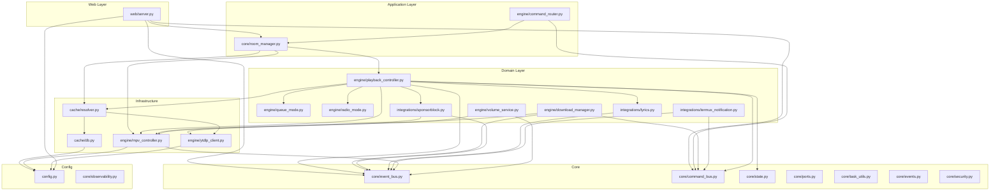

# AUDIT ARSITEKTUR — YTGUI Phase 3

---

## High-Level Architecture

YTGUI menggunakan arsitektur berlapis event-driven dengan 5 layer utama:

```
┌────────────────────────────────────────────┐
│            WEB / TUI Layer                  │  web/server.py, tui/app.py
│     (aiohttp WebSocket + HTML frontend)     │
└──────────────────┬─────────────────────────┘
                   │  CommandBus (write) + EventBus (read)
┌──────────────────▼─────────────────────────┐
│           Application Layer                 │  engine/command_router.py
│     (CommandBus routing ke Room)            │  engine/playback_controller.py
└──────────────────┬─────────────────────────┘
                   │
┌──────────────────▼─────────────────────────┐
│           Domain / Engine Layer             │  engine/*, integrations/*
│  PlaybackController, RadioMode, QueueMode   │
│  VolumeService, DownloadManager             │
└──────────────────┬─────────────────────────┘
                   │
┌──────────────────▼─────────────────────────┐
│         Infrastructure Layer                │  cache/db.py, engine/mpv_controller.py
│   SQLite (aiosqlite), MPV IPC, yt-dlp      │  engine/ytdlp_client.py
└──────────────────┬─────────────────────────┘
                   │
┌──────────────────▼─────────────────────────┐
│            Config / Cross-cutting           │  config.py, core/observability.py
│    logging, metrics, security utils         │  core/security.py, core/log_config.py
└────────────────────────────────────────────┘
```

---

## Mermaid Diagram: Module Dependency



---

## Layering Analysis

### ✅ Yang Benar

- `core/` tidak bergantung ke `engine/` atau `web/` (murni domain model)
- `core/ports.py` mendefinisikan interface (Protocol) yang memisahkan domain dari infrastruktur
- `engine/` bergantung ke `core/` tapi tidak ke `web/`
- `cache/` bergantung ke `core/state.py` dan `config.py` — wajar

### ❌ Pelanggaran Layer

**1. Global EventBus Singleton (KRITIS)**
- File: `core/event_bus.py` baris 72: `bus = EventBus()`
- File: `engine/mpv_controller.py` baris 7: `from core.event_bus import bus`
- `MpvController` mengimpor global `bus` secara langsung, bukan menerima EventBus via dependency injection
- Ini menyebabkan semua room berbagi satu bus — event dari room A bisa di-handle room B
- **Dampak:** Cross-room event contamination

**2. Room menggunakan global `bus` (HIGH)**
- File: `core/room_manager.py` baris 34: `from core.event_bus import bus`
- `VolumeService` dan `PlaybackController` menerima `bus` (global) — bukan EventBus per-room
- Seharusnya setiap Room membuat `EventBus()` instance-nya sendiri

**3. `DownloadManager` hardcode ke global `command_bus` (MEDIUM)**
- File: `engine/download_manager.py` baris 21: `command_bus.register(CMD_DOWNLOAD, self._on_download)`
- Handler menerima `(track, None)` bukan `(room_id, data)` sesuai konvensi CommandBus
- `room_id` diabaikan sepenuhnya

**4. `DiscoverService` akses private `_conn` (LOW)**
- File: `services/discover_service.py` baris 14: `if not getattr(self.db, '_conn', None)`
- Langsung akses attribute private `Database._conn`
- Seharusnya Database mengekspos method `is_connected()` atau cek via public interface

---

## Coupling & Cohesion

### High Coupling (Bermasalah)

| Komponen | Bergantung Ke | Masalah |
|---|---|---|
| `MpvController` | Global `bus` singleton | Tidak bisa di-inject, tidak bisa ditest isolasi |
| `SponsorBlockHandler` | Global `bus` | Sama |
| `LyricsFetcher` | Global `bus` | Sama — semua handler subscribe ke bus yang sama untuk semua room |
| `TermuxNowPlaying` | `command_bus` singleton | Hard-code ke global |
| `web/server.py` | `config.ADMIN_PASSWORD` diimpor saat runtime di handler | Config diimport di dalam fungsi → sulit di-mock |

### Cohesion

- `PlaybackController` memiliki kohesi yang **baik** — single responsibility untuk orchestrate playback
- `web/server.py` memiliki kohesi **rendah** — mixing routing, auth logic, rate limiting, event bridging, dan business logic dalam satu file besar (24KB)
- `config.py` memiliki **side effect** saat import — membaca file, generate password, print ke stdout — ini anti-pattern

---

## SOLID Compliance

| Prinsip | Status | Keterangan |
|---|---|---|
| **SRP** | ⚠️ Partial | `web/server.py` melanggar — terlalu banyak tanggung jawab |
| **OCP** | ✅ Baik | Penambahan event type atau command tidak memerlukan modifikasi core |
| **LSP** | ✅ Baik | Protocol/Port digunakan dengan benar |
| **ISP** | ✅ Baik | Interface kecil dan spesifik (`AudioPlayerPort`, `MediaExtractorPort`) |
| **DIP** | ⚠️ Partial | `MpvController`, `LyricsFetcher`, `SponsorBlockHandler` bergantung ke singleton global bukan abstraksi |

---

## Clean Architecture Compliance

| Layer Rule | Status |
|---|---|
| Entities (`core/state.py`) tidak import outer layer | ✅ |
| Use Cases (`engine/`) tidak import UI (`web/`, `tui/`) | ✅ |
| Infrastructure bergantung ke abstraksi (Port) | ✅ |
| Global singleton menembus batas layer | ❌ |
| Config dengan side-effect saat import | ❌ |

---

## Anti-Patterns Ditemukan

1. **Singleton Abuse** — `bus`, `command_bus` sebagai module-level singleton; sulit test, sulit scale multi-room
2. **Side-Effect at Import** — `config.py` membaca file, print password, generate secrets saat diimport
3. **God File** — `web/server.py` (24KB, ~550 baris) menangani routing, auth, rate limit, event bridging
4. **Primitive Obsession** — `room_id` adalah string tanpa validasi/typing khusus
5. **Hardcoded MPV socket path** — `main.py` `mpv_reconnect_checker` menggunakan `MPV_SOCKET` global bukan per-room path
