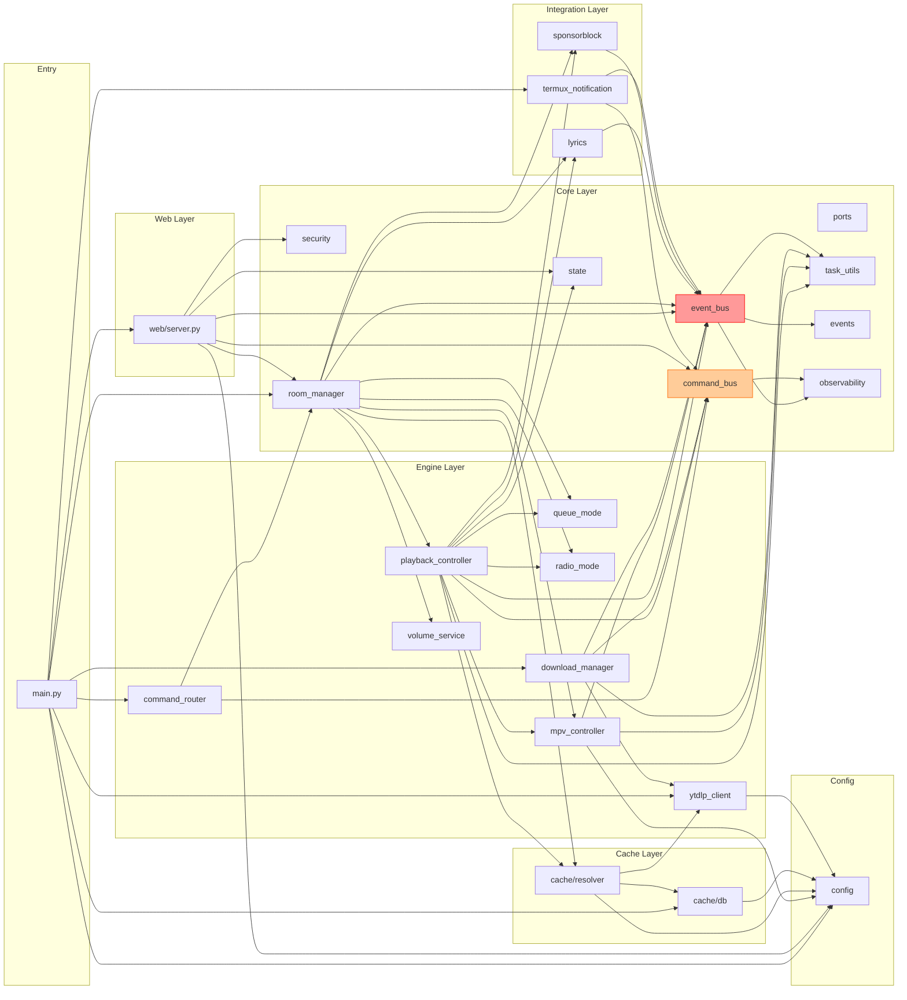
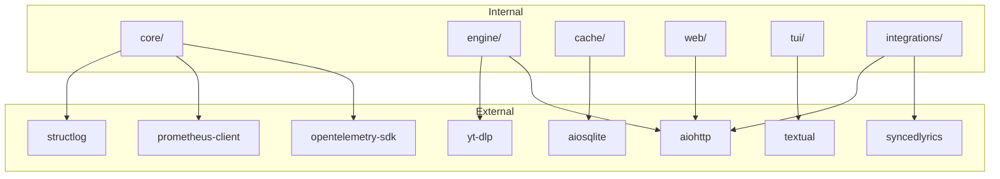

# AUDIT DEPENDENCY GRAPH — YTGUI Phase 3

---

## Module Dependency Graph (Per Package)



**Merah = Global Singleton (risiko tinggi)**  
**Orange = Singleton (risiko medium)**

---

## Circular Dependency Report

### Tidak Ditemukan Circular Import Langsung

Dependency direction sudah cukup baik:
- `core/` tidak import dari `engine/` atau `web/`
- `engine/` tidak import dari `web/`
- `cache/` tidak import dari `engine/`

### Deferred Import (Potensial Circular)

```
core/room_manager.py → (deferred) from core.event_bus import bus
```

Import ini dilakukan di dalam method bukan di top level. Ini biasanya menandakan ada upaya menghindari circular import. Saat ini tidak ada circular, tapi patut diperhatikan.

---

## Package Dependency Graph



---

## Modul Paling Berisiko (berdasarkan coupling)

| Rank | Module | Fan-in (dependen) | Fan-out (bergantung) | Risk |
|---|---|---|---|---|
| 1 | `core/event_bus.py` | 10+ (semua modul) | 2 (task_utils, events) | 🔴 SANGAT TINGGI |
| 2 | `core/state.py` | 8+ | 0 | 🟠 TINGGI (perubahan cascade) |
| 3 | `config.py` | 8+ | 0 | 🟠 TINGGI (side effect) |
| 4 | `core/command_bus.py` | 6+ | 1 (observability) | 🟠 TINGGI |
| 5 | `web/server.py` | 0 | 10+ | 🟡 MEDIUM (god file) |
| 6 | `engine/playback_controller.py` | 2 (room_manager, command_router) | 8+ | 🟡 MEDIUM |
| 7 | `cache/db.py` | 4 (resolver, discover, main, web) | 1 (config) | 🟡 MEDIUM |

---

## Rekomendasi Dependency Restructuring

### Prioritas 1: Pisahkan Global EventBus

Masalah terbesar adalah `core/event_bus.py` memiliki singleton `bus` yang digunakan oleh hampir semua modul. Ini membuat refactor ke multi-room sejati tidak mungkin tanpa breaking change besar.

**Target State:**
```
core/event_bus.py  ← hanya class EventBus, tidak ada singleton
core/room_manager.py ← setiap Room membuat EventBus sendiri
```

### Prioritas 2: Config Tanpa Side Effect

`config.py` harus menjadi pure constants. Logika startup (password generation, file reading) pindah ke `startup.py` atau `AppConfig` class.

### Prioritas 3: Pisahkan `web/server.py`

Modul dengan fan-out besar dan logika yang bercampur adalah kandidat refactor untuk dipecah.
